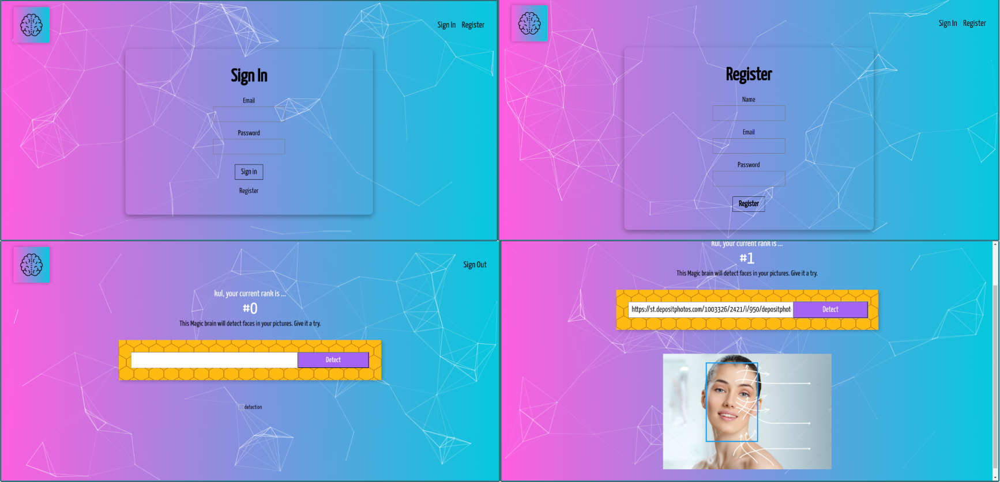

# Face Recognition App Frontend
This is the final project of the "The Complete Web Developer in 2020 Zero to Mastery" course by Andrei Neagoie. The course is geared towards complete beginners and the instructor thoroughly explains every aspects of modern full stack app designing and building.

Currently the full project is being hosted on heroku.

## To use
To use the app, you need to go to the register page. Email validation is not implemented here, so you can put fake email addresses and the password can be of any number of digits. Use email and password to sign in. Pass an url of the image location in the box and tap on the detect button. The countdown will increase as per detection.

## Technology used
* react.js
* react-particles.js
* react-tilt
* tachyons